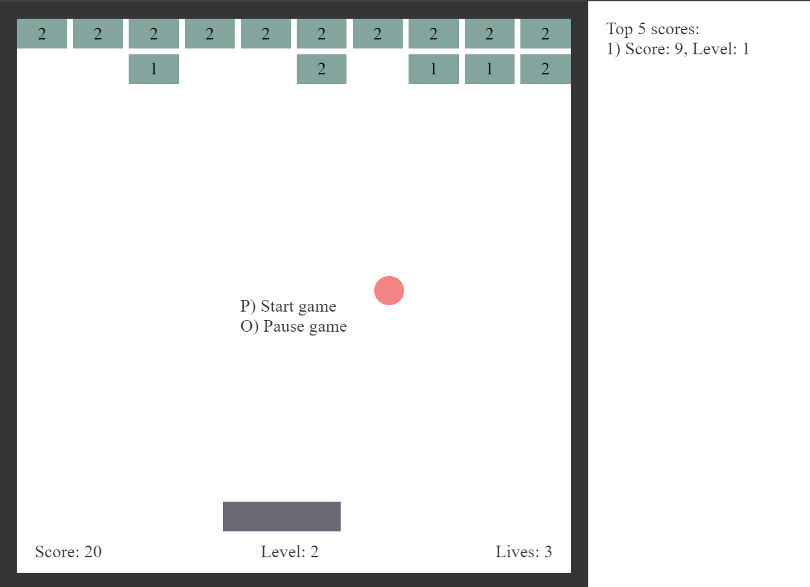

# Pure JS Breakout Demo

This is a pure JavaScript implementation of the classic Breakout game. The game is developed without using the `<canvas>` element, making it a unique learning project. **Work is still in progress.**

  

## Getting Started

To get started with the project, follow these steps:

1. Clone the repository:
    ```sh
    git clone <repository-url>
    cd repository
    ```

2. Run the project with no caching:
    ```sh
    npx http-server -c-1
    ```

## http-server

Files are served from [`./public`](/public/) if the folder exists, and [`./`](/) otherwise.

For more information, refer to the [npm http-server documentation](https://www.npmjs.com/package/http-server).

## Game Features

- **Dynamic UI**: The game interface is dynamically created using DOM manipulation.
- **Game Logic**: The game logic is handled in [`src/brain.ts`](./public/js/brain.js).
- **UI Rendering**: The UI rendering is managed by the [`UI`](./public/js/ui.js) class in [`src/ui.ts`](./public/js/ui.js).

## How to Play
- **Start Game**: Press `P` to start the game.
- **Pause Game**: Press `O` to pause the game.
- **Game Over**: The game displays a "Game Over" message when you lose.

## TypeScript Version

TypeScript version of this game is also available. You can find it at the following repository: [TS Breakout Demo](https://github.com/j-vinnal/TS-Breakout-Demo).


## Contributing

Contributions are welcome! Please feel free to submit a Pull Request.

## License

This project is licensed under the MIT License.